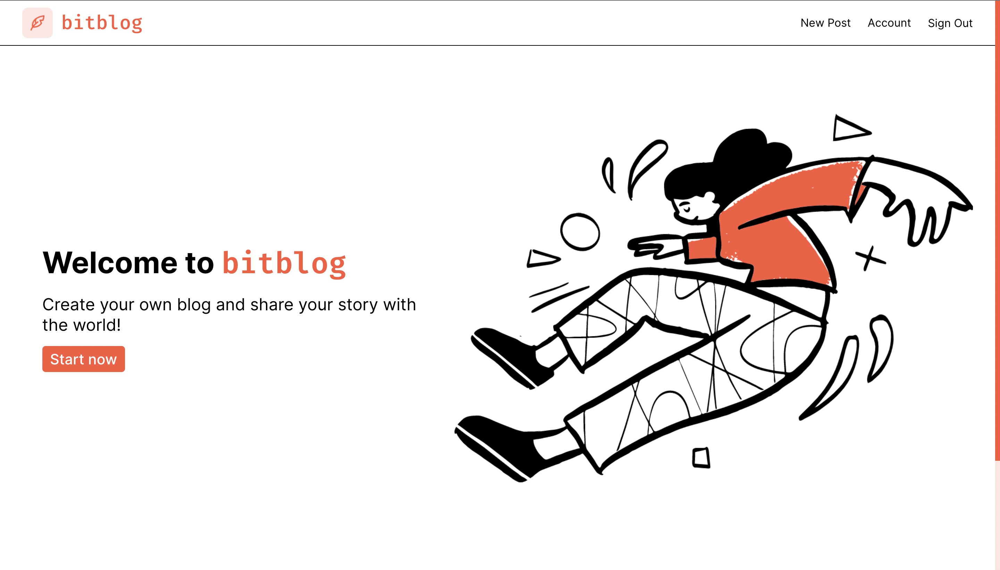
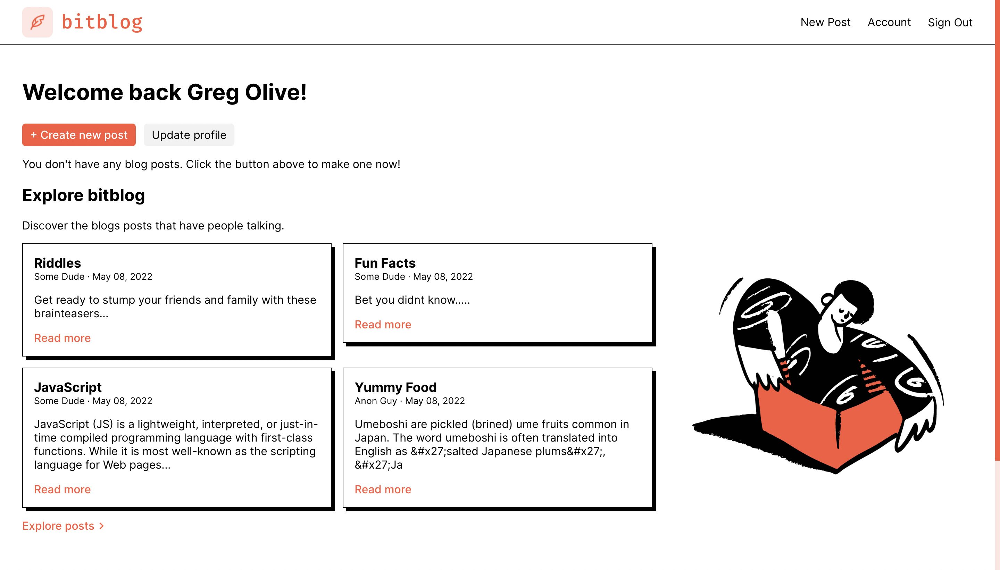
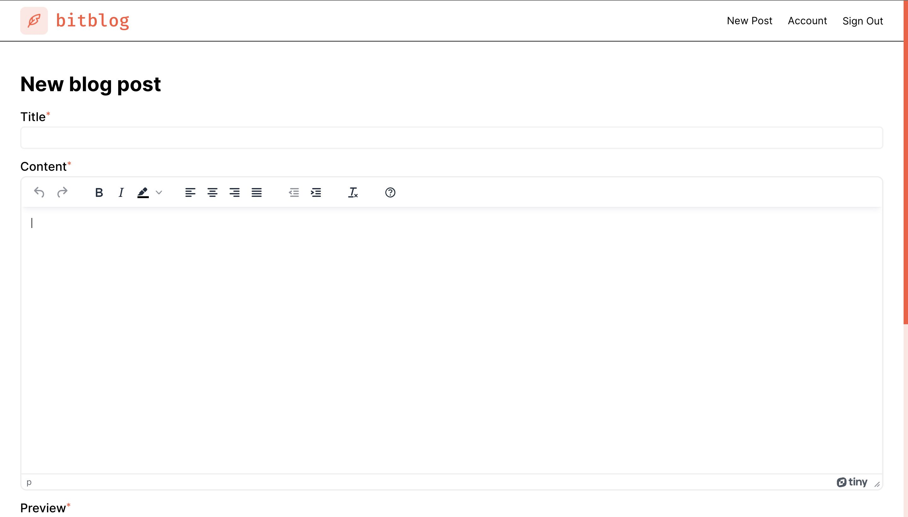

# bitblog

A platform for creating and managing a blog.

[Live demo](https://gregolive.github.io/blog-platform/) 👈

[Backend repo](https://github.com/gregolive/blog-api) 🔗

## Features

- A MERN stack app (<code>React</code> frontend, <code>Express</code>/<code>Node</code> backend, and <code>MongoDB</code> database)
- CRUD operations for users, blog posts and comments enabled by the RESTful API backend
- Additional API calls avaliable for more specific actions (ie. GET the posts of a specific user only)
- Rich text editor for creating posts via the <code>TincyMCE API</code>
- Users authenticated in the backend with <code>PassportJS</code> via a local srategy and a JWT stored in LocalStorage ensures the user remains authenticated as they navigate the site
- Password are hashed and salted with <code>bcrypt</code> for secure storage
- Front end routing via <code>React Router</code>
- Form validation via Javascript's <code>Constraint validation API</code>

## Attribution

- Logo/favicon created by [Vintage icons - Flaticon](https://www.flaticon.com/free-icons/vintage)
- Doodles created by [Open Doodles](https://www.opendoodles.com/)

## Screenshots

#### Homepage

